# CIPHER

## Solana Pump.fun Sniper Bot | Creator Scoring System | Paper Trading

> **Intelligent token sniping with creator trust analysis and risk management**

---

## Overview

**CIPHER** is an advanced Solana trading bot that monitors Pump.fun token launches in real-time, evaluates creator credibility through a trust scoring system, and executes paper trades with configurable risk parameters.

---

## System Architecture

```mermaid
flowchart TB
    subgraph INPUT["📡 Data Sources"]
        WS[Pump.fun WebSocket]
        RPC[Solana RPC]
    end

    subgraph COLLECTOR["🔍 Data Collector"]
        CONNECT[WebSocket Connection]
        SUBSCRIBE[Event Subscription]
        PARSE[Message Parser]
    end

    subgraph ANALYSIS["🧠 Analysis Engine"]
        CREATOR[Creator Analyzer]
        SCORE[Trust Score Calculator]
        HISTORY[Historical Performance]
    end

    subgraph TRADER["💹 Paper Trader"]
        EVAL[Token Evaluator]
        POSITION[Position Manager]
        EXIT[Exit Logic]
    end

    subgraph STORAGE["💾 Database"]
        TOKENS[Tokens Table]
        CREATORS[Creators Table]
        TRADES[Trades Table]
        PORTFOLIO[Portfolio Table]
    end

    WS --> CONNECT --> SUBSCRIBE --> PARSE
    RPC --> ANALYSIS
    PARSE --> CREATOR --> SCORE
    HISTORY --> SCORE
    SCORE --> EVAL --> POSITION --> EXIT

    PARSE --> TOKENS
    CREATOR --> CREATORS
    POSITION --> TRADES
    EXIT --> PORTFOLIO

    style INPUT fill:#e3f2fd
    style COLLECTOR fill:#fff3e0
    style ANALYSIS fill:#e8f5e9
    style TRADER fill:#fce4ec
    style STORAGE fill:#f3e5f5
```

---

## Real-Time Data Collection Flow

---

## Creator Trust Scoring System

---

## Position Sizing Logic

---

## Exit Strategy System

---

## Hot Reload Control System

---

## Database Schema

---

## Module Architecture

---

## Configuration Parameters

| Category | Parameters | Description |
|----------|------------|-------------|
| **Portfolio** | 3 | Initial balance, max positions, max size |
| **Risk Management** | 4 | Stop loss, take profit levels |
| **Creator Scoring** | 5 | Min score, min tokens, thresholds |
| **Position Sizing** | 4 | Size per score tier |
| **Control** | 6 | Hot reload parameters |
| **Total** | **22** | Full customization |

---

## Technology Stack

| Component | Technology |
|-----------|------------|
| **Blockchain** | Solana |
| **DEX** | Pump.fun |
| **Language** | Python 3.11+ |
| **Async** | asyncio, aiohttp |
| **WebSocket** | websockets |
| **Database** | SQLite (aiosqlite) |
| **Config** | JSON hot reload |

---

## Key Features

- **Real-Time Monitoring** - WebSocket connection to Pump.fun for instant token detection
- **Creator Trust Scoring** - Historical performance analysis for risk assessment
- **Dynamic Position Sizing** - Score-based allocation protects capital
- **Paper Trading Mode** - Validate strategy without risking real funds
- **Hot Reload Config** - Adjust parameters without restarting
- **Emergency Controls** - One-click close all positions
- **Comprehensive Logging** - Track every decision for analysis

---

## Trading Flow Summary

---

## Capabilities Demonstrated

- **Blockchain Integration** - Solana ecosystem, DEX protocols
- **Real-Time Systems** - WebSocket streaming, async processing
- **Risk Management** - Position sizing, stop losses, take profits
- **Data Analysis** - Creator scoring, historical performance
- **System Design** - Modular architecture, hot reload configuration
- **Python Async** - High-performance concurrent operations

---

**Technologies:** Python | Solana | Pump.fun | WebSocket | SQLite | Asyncio

**Category:** Cryptocurrency | Trading Systems | Blockchain | DeFi

---

*This project demonstrates capability to build sophisticated crypto trading systems with real-time data processing, risk management, and intelligent decision-making algorithms.*
